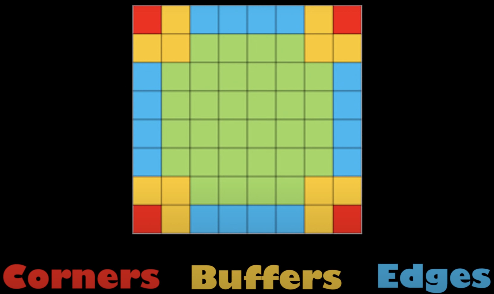

# strategy

## Frontier

A good strategy is to maximize the number of interior disks, and minimizing the number of frontier disks.
A frontier disk is a disk that touches the empty squares of the board, and interior disks does only have other occupied squares around them.

## Strategy for going for corners, edges, and center

A good strategy for Othello is to lay in the corners first and then the edges.
Also important to have pieces in the center and to then move to the corners and sides from there.

I, Lucas, therefore think it would be a good idea to call `GameState.getBoard()`, returns a two dimensional int array, so we can look at how big the board is.

Below is a heat map of where pieces should be laid, the red is highest priority, the blue secondary, the green third, and the yellow is the lowest priority.

## Strategy for going for captures

It is also important to lay in positions where you can capture the opponents pieces, for this we can use `GameState.captureInDirection(Position p, int deltaX, int deltaY)`, which returns an int.

