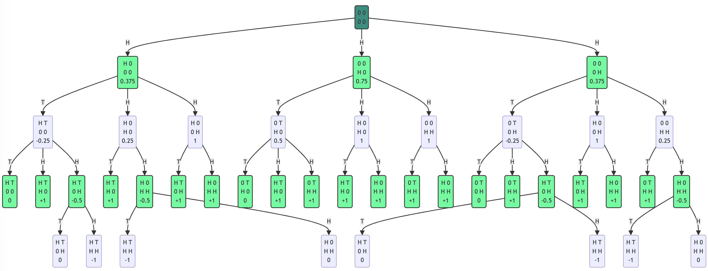

# Mandatory assignment Week 4

Made by Christian Bank Lauridsen [chbl@itu.dk](mailto:chbl@itu.dk).\
Worked together with Lucas Frey Torres Hanson [luha@itu.dk](mailto:luha@itu.dk)

## Part 1

```pseudo
function EXPECTIMINIMAX-SEARCH(state) returns an action 
  value, move ← MAX-VALUE(state)
  return move

function MAX-VALUE(state) returns a (utility, move) pair
  if IS-TERMINAL(state) then 
    return UTILITY(state, MAX), null 
  v ← −∞
  for each a in ACTIONS(state) do
      v2 ← CHANCE-VALUE(RESULT(state, a), MAX) //next action
      if v2 > v then
        v, move ← v2, a 
  return v, move

function MIN-VALUE(state) returns a (utility, move) pair
  if IS-TERMINAL(state) then 
    return UTILITY(state, MIN), null
  v ← +∞
  for each a in ACTIONS(state) do
    v2 ← CHANCE-VALUE(RESULT(state, a), MIN) //next action
    if v2 < v then
        v, move ← v2, a
  return v, move

function CHANCE-VALUE(state, player) returns (utility) pair
  v ← 0
  for each a in ACTIONS(state) do
    if player is MAX then
      v2, a2 ← MIN-VALUE(RESULT(state, a))
      v ← v + (v2 * P(p)) //P(p) is the probability
    else:
      v2, a2 ← MAX-VALUE(RESULT(state, a))
      v ← v + (v2 * P(p)) //P(p) is the probability
  return v
```

## Part 2

The blue color node in the top is the initial state of the game.\
The green color nodes in the tree are  MAXs  actions.\
The grey color nodes in the tree are MINs actions.

### Part 2.a



### Part 2.b

The following nodes should be read from the left to right in the tree. The EXPECTIMINIMAX values can also be seen in the drawing of the game tree.
The following will show the calculations for the EXPECTIMINIMAX value for each node.

The values of the bottom nodes in the tree:

- 0
- -1
- -1
- 0
- 0
- -1
- -1
- 0

The values of the second lowest nodes in the tree:

- 0
- +1
- (0.5\*0 + 0.5\*(-1)) = -0.5
- +1
- (0.5\*(-1) + 0.5\*0) = -0.5
- +1
- +1
- 0
- +1
- +1
- +1
- +1
- +1
- +1
- 0
- +1
- (0.5\*0 + 0.5\*(-1)) = -0.5
- +1
- +1
- +1
- (0.5\*(-1) + 0.5\*0) = -0.5

The values of the third lowest nodes in the tree:

- (0.5\*0 + 0.5\*(-0.5)) = -0.25
- (0.5\*1 + 0.5\*(-0.5)) = 0.25
- (0.5\*1 + 0.5\*1) = 1
- (0.5\*0 + 0.5\*1) = 0.5
- (0.5\*1 + 0.5\*1) = 1
- (0.5\*1 + 0.5\*1) = 1
- (0.5\*0 + 0.5\*(-0.5)) = -0.25
- (0.5\*1 + 0.5\*1) = 1
- (0.5\*1 + 0.5\*(-0.5)) = 0.25

The values of the top (second layer) layer:

- (0.5\*(-0.25) + 0.5\*1) = 0.375
- (0.5\*0.5 + 0.5\*1) = 0.75
- (0.5\*(-0.25) + 0.5\*1) = 0.375

### Part 2.c

The EXPECTIMINIMAX decision for MAX is to go down the middle node in the tree since it has the highest EXPECTIMINIMAX value of 0.75 and therefore has the highest chance of winning.
