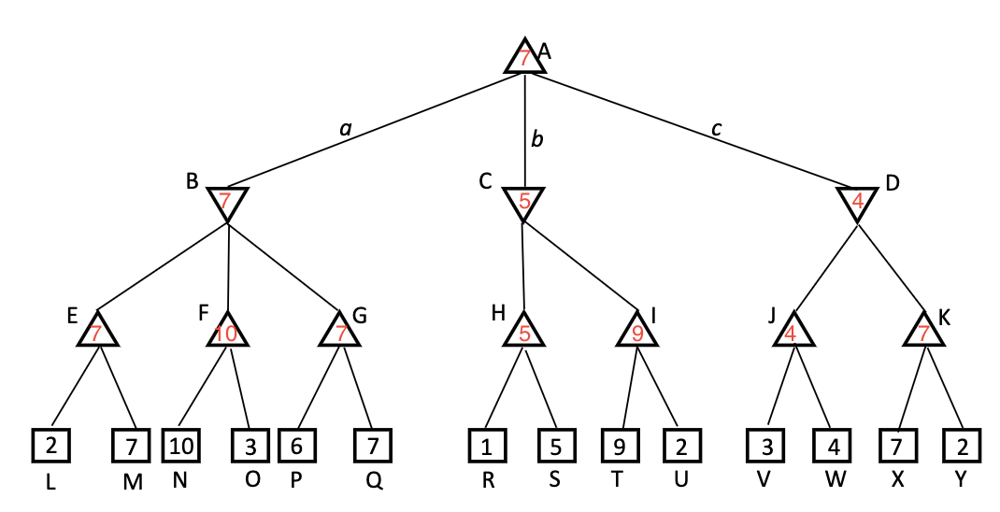

# Exercises for week 4

## Exercise 1

### 1.a

### 1.b

Looking at the minimax value it is first the best for black to go to the right branch (black move piece to a3).\
Then white the minimal value option is between three threes.
Therefore white has no option than to choose one of the threes (white moves piece either to b5, b4, b3, or a2)

The minimax value is **+2**.

### 1.c

The root action that black has to move is a3. 
Since it gives us the minimax value of +2.

## Exercise 2

### 2.a

Max will choose the path a (right path) since it will give 7 points as seen on the picture below:

### 2.b

Given the following picture we do not need to examine the nodes:

- O
- I
  - T
  - U
- K
  - X
  - Y

## Exercise 3

If Min uses a suboptimal stategy then Max will never underestimate the value of the root node.
The reason is due to the fact that Max will always choose the highest value of the children nodes based upon that Min will choose the lowest value of the children nodes.
Therefore Max will never underestimate the value of the root node.

If Max goes for the global biggest root.\
When it is Min's turn he will go for a random state.

This results in that Max first will go for the right path.\
Then Min goes for the right path.\
Then Max goes for the right path resulting in getting 50 points.

If the Minmax algorithm had been used the result would have been 7 points.
