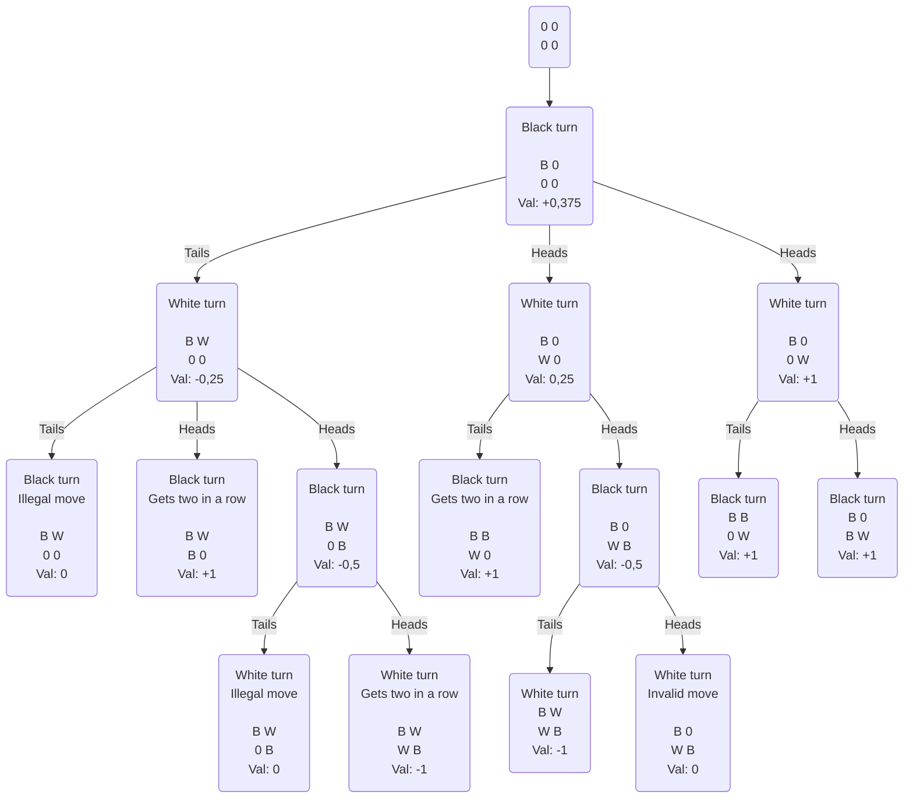

# Mandatory assignment Week 4

Made by Lucas Frey Torres Hanson [luha@itu.dk](mailto:luha@itu.dk).\
Worked together with Christian Bank Lauridsen [chbl@itu.dk](mailto:chbl@itu.dk).

## Part 1

## Part 2

### Part 2.a and 2.b

### Part 2.c

The expected minimax decision for Max would be to choose the middle node with the value of 0.75.
It would give him the best odds of winning the game.
