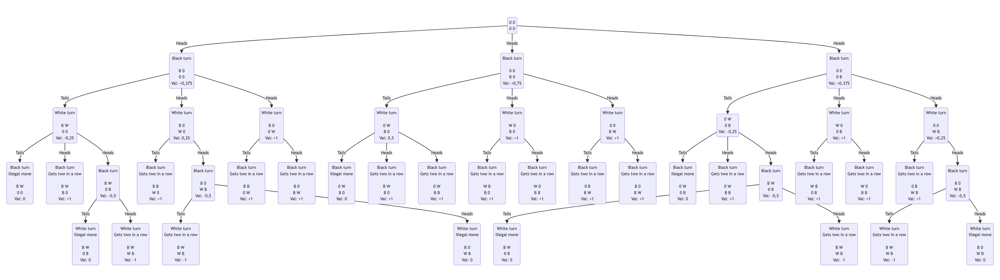

# Mandatory assignment Week 4

Made by Lucas Frey Torres Hanson [luha@itu.dk](mailto:luha@itu.dk).\
Worked together with Christian Bank Lauridsen [chbl@itu.dk](mailto:chbl@itu.dk).

## Part 1

```pseudo
function EXPECTIMINIMAX-SEARCH(state) returns an action 
  value, move ← MAX-VALUE(state)
  return move

function MAX-VALUE(state) returns a (utility, move) pair
  if IS-TERMINAL(state) then 
    return UTILITY(state, MAX), null
  v ← −∞
  for each a in ACTIONS(state) do
      v2, a2 ← CHANCE-VALUE(RESULT(state, a), MAX) //next action
      if v2 > v then
        v, move ← v2, a 
  return v, move

function MIN-VALUE(state) returns a (utility, move) pair
  if IS-TERMINAL(state) then 
    return UTILITY(state, MIN), null
  v ← +∞
  for each a in ACTIONS(state) do
    v2, a2 ← CHANCE-VALUE(RESULT(state, a), MIN) //next action
    if v2 < v then
        v, move ← v2, a
  return v, move

function CHANCE-VALUE(state, player) returns (utility, move) pair
  sum ← 0
  for each a in ACTIONS(state) do
    // Will for each action simulate the next players action
    // to calculate the expected value of the action
    if player is Max then
      v, a2 ← MIN-VALUE(RESULT(state, a))
    else
      v, a2 ← MAX-VALUE(RESULT(state, a))
    sum ← sum + P(a)*v
  return sum, null
```

## Part 2

### Part 2.a and 2.b

The below both shows the game tree and what each node would be evaluated to.

<!--  -->


All the values have been calculated so by the following.

- The node which is reached given tails was multiplied by 0,5.
- Then the node which gave the optimal value given tails was multiplied by 0,5 (of course optimal depends on if we are at a max (black) or a min (white) node).
- These two values where then added together to give the value of the node.

### Part 2.c

The expected minimax decision for Max would be to choose the middle node with the value of 0.75.
It would give him the best odds of winning the game.
