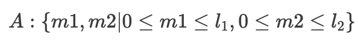
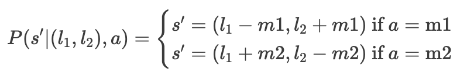
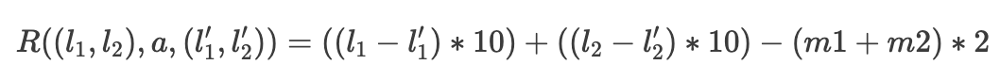

# Mandatory assignment Week 4

Made by Christian Bank Lauridsen [chbl@itu.dk](mailto:chbl@itu.dk).\
Worked together with Lucas Frey Torres Hanson [luha@itu.dk](mailto:luha@itu.dk)

## Mandatory exercise - Markov decision process

### Part a

#### State space

Where `l1` is the number of availbable cars at location 1 and `l2` is the number of availbable cars at location 2.

#### Action space

Where `m1` is the amount of moved cars from location 1 to location 2, and `m2` is the amount of moved cars from location 2 to location 1.

### Part b

#### Transition function

This gives the of transitioning from state `s = (l1,l2)` to state `s'` using action `a` which is either `m1` or `m2`.

#### Reward function

It cost the owner 2$ to move a car.
And the owner gets 10$ per rented car.
The reward function can then be defined like this:

The reward function consist of the amount of revenue from rented cars at location 1,plus the amount of revenue from rented cars at location 2, minus the cost of moved cars from location 1 to location 2 and the cost of moved cars from location 2 to location 1.

### Part c

At location 2, Jack loses two cars, since four cars are rented out and two are returned. Which means that he at some point will run out of cars at location 2.
At location 1, Jack loses zero cars, since three cars are rented out and three are returned.
The optimal policy for maximizing profit would be to always make sure that there are three cars avaiblable at location 1, and transfer all the other 17 cars to location 2.

If Jack has less than three cars at location 1, then he will have to move cars from location 2 to location 1 with a maximum cost of 6$ (the scenario where location 1 is out of cars).
But at day one he will always have three cars at location 1, so it is unlikely that he will move cars from location 2 to location 1.

It is also unlikly that Jack will keep up with the total rental demand, since he eventually will run out of cars at location 2.
