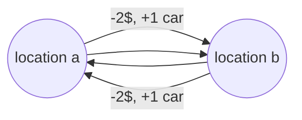

# Mandatory assignment Week 5

Made by Lucas Frey Torres Hanson [luha@itu.dk](mailto:luha@itu.dk).\
Worked together with Christian Bank Lauridsen [chbl@itu.dk](mailto:chbl@itu.dk).

## Part a

Set of states $S$:

$$
S: \{(loc_a,loc_b) | 0 ≤ a ≤ 20, 0 ≤ b ≤ 20\}
$$

$a$ and $b$ are the two rental locations and contains the number of cars each location has.

Action function $A$:

$$
A(s): \{move_a, move_b | 0 ≤ m_a ≤ a, 0 ≤ m_b ≤ b\}
$$

Where $m_a$ means to move a car from location $b$ to $a$, $m_b$ means to move a car from location $a$ to $b$.

## Part b

Transition function $P$:

Move from location a to b $\{loc_a-1_{car}, loc_b+1_{car}\}$

Move from location b to a $\{loc_b-1_{car}, loc_a+1_{car}\}$

## Part c
