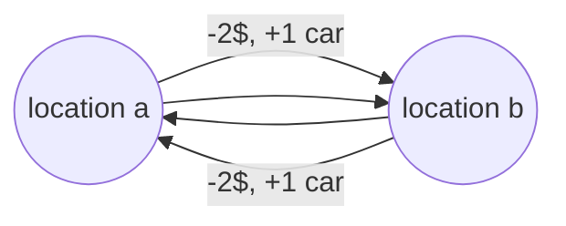

# Mandatory assignment Week 5

Made by Lucas Frey Torres Hanson [luha@itu.dk](mailto:luha@itu.dk).\
Worked together with Christian Bank Lauridsen [chbl@itu.dk](mailto:chbl@itu.dk).

## Part a

Set of states $S$:

$$
S: \{(loc_a,loc_b) | 0 ≤ a ≤ 20, 0 ≤ b ≤ 20\}
$$

$a$ and $b$ are the two rental locations and contains the number of cars each location has.

Action function $A$:

$$
A(s): \{move_{ab}, move_{ba} | 0 ≤ m_a ≤ a, 0 ≤ m_b ≤ b\}
$$

Where $move_{ab}$ means to move a car from location $a$ to $b$, $move_{ba}$ means to move a car from location b to $b$.

## Part b

### Transition function $P$

Move from location a to b: $move_{ab}: \{loc_a-1_{car}, loc_b+1_{car}\}$

Move from location b to a: $move_{ba}: \{loc_b-1_{car}, loc_a+1_{car}\}$

$$
P(s\{loc_a|loc_b\}|s'\{loc_b|loc_a\},a\{move_{ab}|move_{ba}\})
$$

### Reward function $R$

To move a car from location a to b, and vice versa, it costs 2$.\
Therefore, the reward function is:

$$
R(s\{loc_a|loc_b\},a\{m_1|m_2\},s'\{loc_b|loc_a\}) = -2\$
$$

## Part c

Due to location a getting an equal amount of cars rented and returned, this can keep running indefinitely and keep getting 20$ total per day.\
Location b is not as lucky, as it gets four cars rented and two cars returned.
This mean for a while Jack will get 40$ per day, but then it will drop to 20$ per day (when he gets two cars returned).
After he will have no cars left and will not get any money.\
Then Jack has the option to move cars from location a to b, to help location b get revenue.
The problem is that it will costs Jack 2$ per car moved, which will make him lose money.
He will then also at some point \
The alternative is just not to get revenue from location b, which would be more profitable for Jack as he would then be able to keep running location a.\
The best alternative would be to move all cars except four cars from location a to b, and then keep running location a.
This would shortly give a boost in revenue as location b can keep running for a while longer, and location a would still be able to keep running indefinitely.
