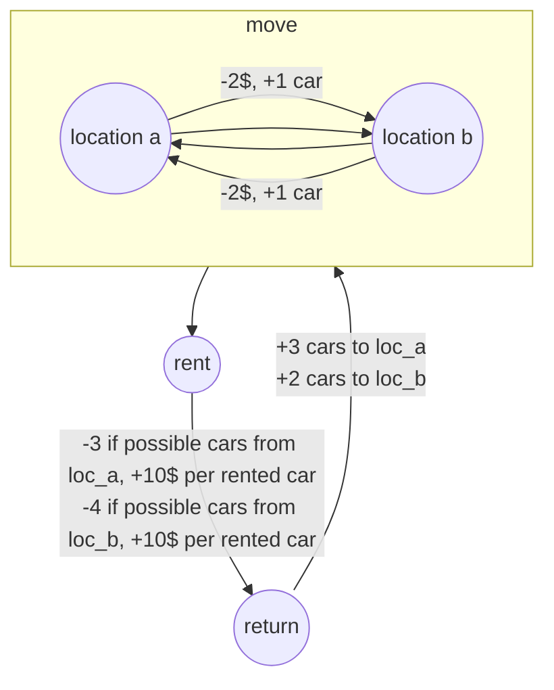

# Shows rental

```mermaid
flowchart TD
  ren((rent)) -- -3 if possible cars from loc_a, +10$ per rented car\n-4 if possible cars from loc_b, +10$ per rented car --> ret((return))
  ret -- +3 cars to loc_a\n+2 cars to loc_b --> move
  move --> ren

  subgraph move
    direction LR
    a((location a)) -- -2$, +1 car --> b((location b))
    a --> b
    b --> a
    b -- -2$, +1 car --> a
  end
```
