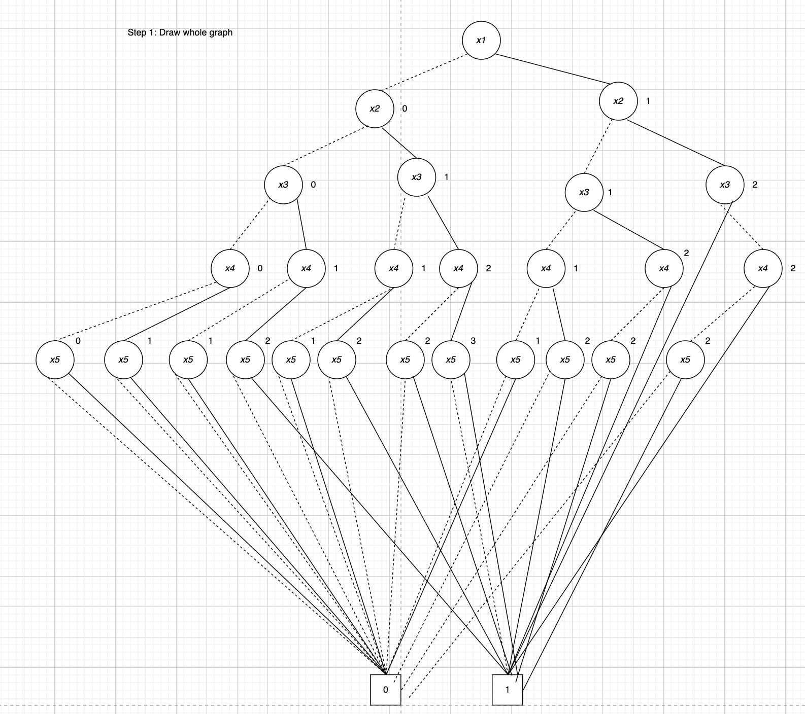
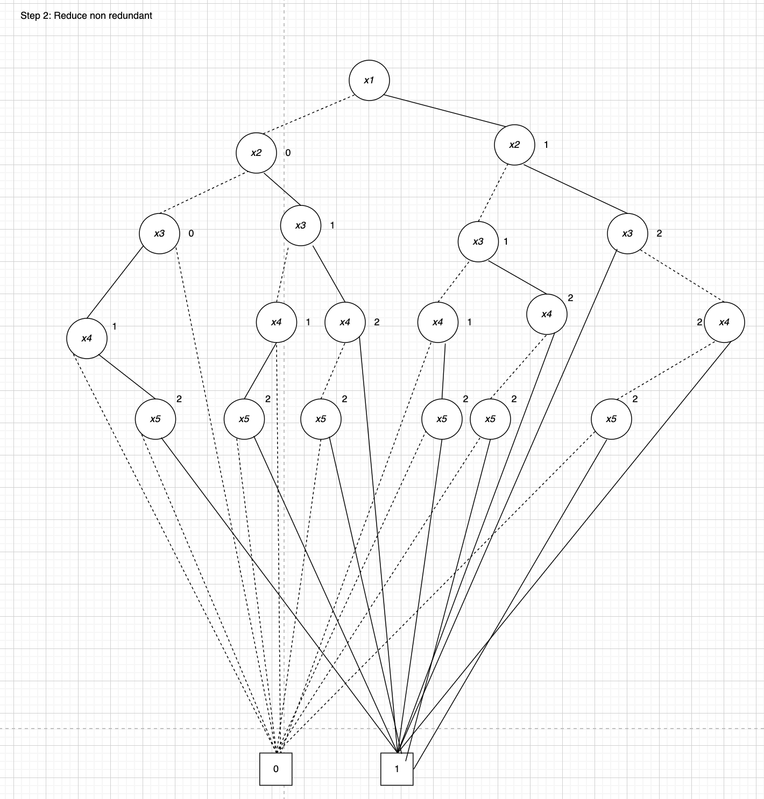
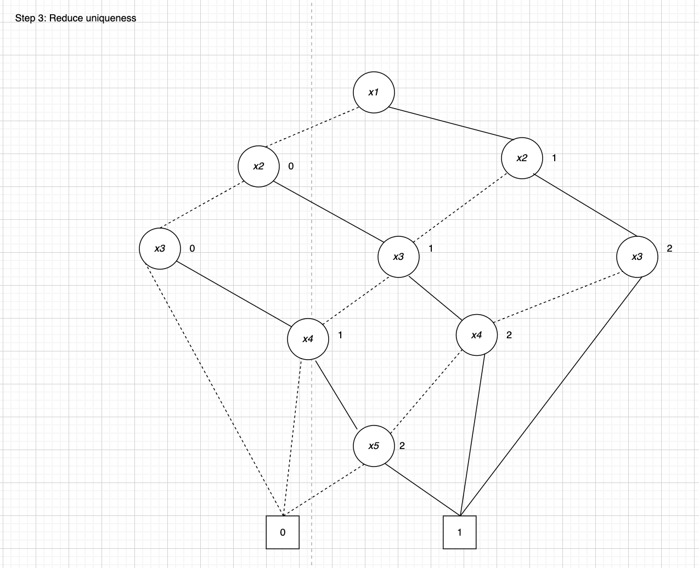
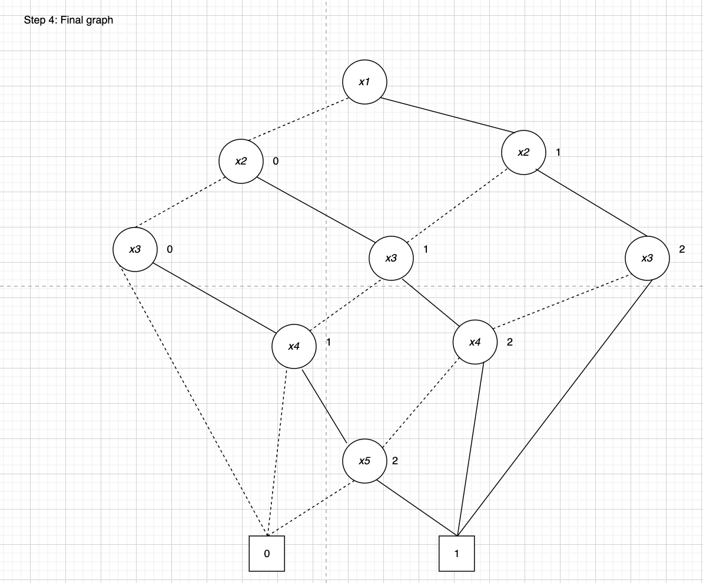

# Mandatory assignment Week 7

Made by Christian Bank Lauridsen [chbl@itu.dk](mailto:chbl@itu.dk).\
Worked together with:

- Lucas Frey Torres Hanson [luha@itu.dk](mailto:luha@itu.dk)
- Asger Clement Nebelong Lysdahl - [asly@itu.dk] (mailto:asly@itu.dk)

## ROBDD

### Whole graph (reduced for x5)

### Reduce for non redundant

### Reduce uniqness

### Final graph

