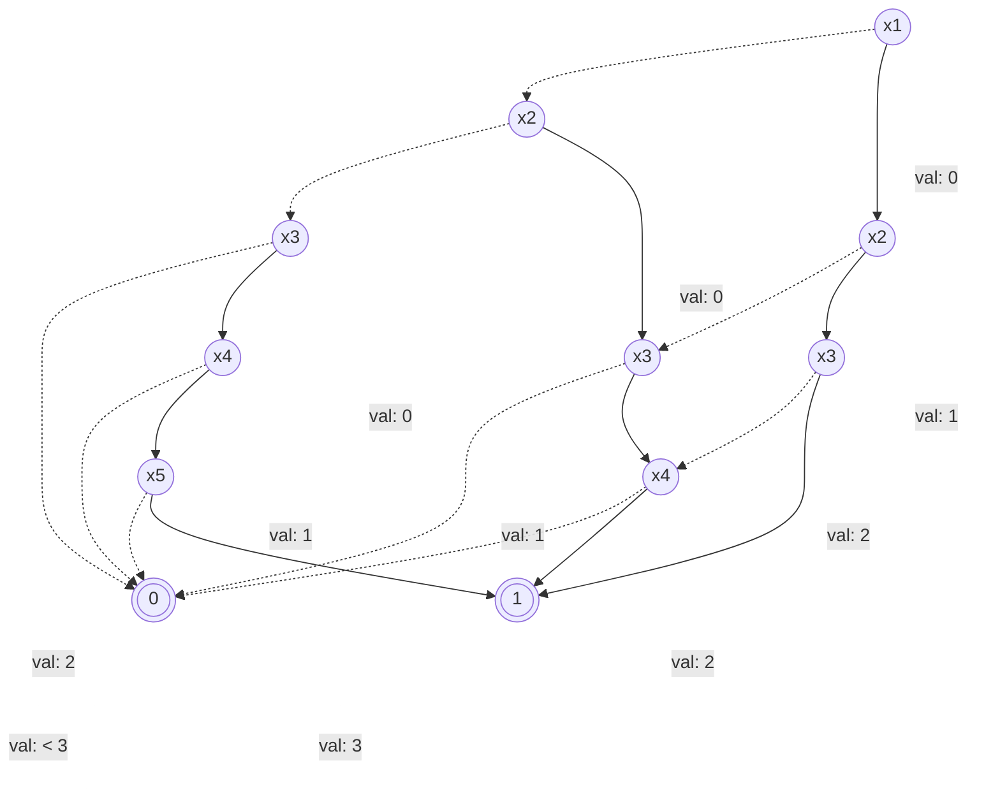

```mermaid
flowchart TD
    x1((x1)) -.-> x20((x2))
    x20 -.-> x30((x3))
    x30 -.-> false(((0)))
    x21 -.-> x31((x3))
    x41 -.-> false
    x42 -.-> false
    x52 -.-> false
    x32 -.-> x42((x4))
    x31 -.-> false

    x1 --> x21((x2))
    x20 --> x31((x3))
    x21 --> x32((x3))
    x30 --> x41((x4))
    x32 --> true(((1)))
    x31 --> x42((x4))
    x42 --> true
    x41 --> x52((x5))
    x52 --> true

    x1 ~~~| val: 0 | x1
    x20 ~~~|"val: 0"| x20
    x30 ~~~| val: 0 | x30
    x21 ~~~| val: 1 | x21
    x32 ~~~| val: 2 | x32
    x42 ~~~| val: 2 | x42
    x31 ~~~| val: 1 | x31
    x41 ~~~| val: 1 | x41
    x52 ~~~| val: 2 | x52
    true ~~~| val: 3 | true
    false ~~~| val: < 3 | false
```