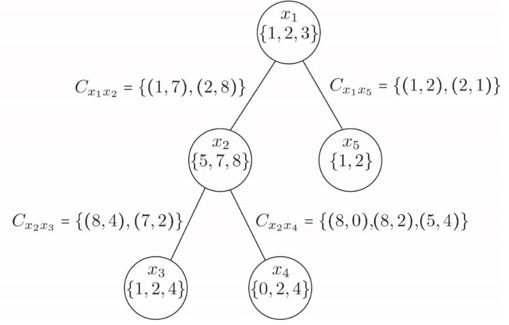
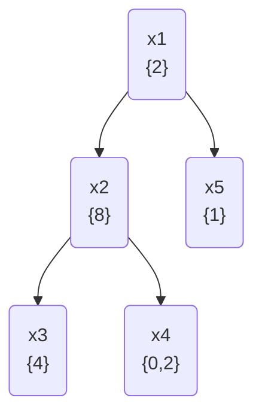

# Exercises for week 9

## Exercise 1

The code of Professor Smart’s safe is a sequence of 4 distinct (i.e., all different) nonzero digits, C1,... ,C4 such that the following equations and inequalities are satisfied:

- C1 ≠ 1, C2 ≠ 2, C3 ≠ 3, C4 ≠ 4
- C4 – C3 > 2
- C3 + C1 ≥ 5
- C1 * C2 ≥ 6
- C1 + C2 ≤ 7
- C3 ≤ 5 C4 > 4

A CSP model for this problem is:

Variables:  {C1, C2, C3, C4}\
Domains:  {[1...6], [1...6], [1...6], [1...6]}\
Constraints: {C1≠C2, C1≠C3, C1≠C4, C2≠C3, C2≠C4, C3≠C4, C1≠1, C2≠2, C3≠3, C4≠4,  C4 – C3 > 2,  C3 + C1 ≥ 5, C1 * C2 ≥ 6, C1 + C2 ≤ 7, C3 ≤ 5, C4 > 4 }

## 1.a

Use backtracking to find a solution, assume the order {C1, C2, C3, C4} for the selection of the variables, draw the search tree and show in the failed leaves which constraint is the one that fails.

## 1.b

## Mandatory

In this assignment, we consider binary CSPs where the constraint graph forms a tree. Recall that the nodes and edges of the constraint graph represent variables and constraints, respectively. As an example consider the binary CSP W = (X,D,C) where:

X = {x1, x2, x3, x4, x5};

D1 = {1,2,3}, D2 = {5,7,8}, D3 = {1,2,4}, D4 = {0,2,4}, D5 = {1,2};

C = {  
    Cx1x2={(1,7),(2,8) },\
    Cx1x5={(1,2),(2,1) },\
    Cx2x3={(8,4), (7,2) },\
    Cx2x4={(8,0), (8,2), (5,4) } }.

The constraint graph of W is:

### m.1

Reduce the domains of the variables of W such that W becomes arc consistent.

Reduced domains:

| Domain | Reduced Variables | Changed |
| --- | --- | --- |
| D1 | {2} | 3 removed since none of the constraints use it. 1 removed since domain D2 only has variable 8 |
| D2 | {8} | 5, 7 removed since D3 and D4 only have the common variable 8 |
| D3 | {4} | 1 since constraint does not use it. 2 removed since domain D2 has removed variable 7 |
| D4 | {0,2} | 4 removed since D2 only has variable 8 |
| D5 | {1} | 2 removed since domain 1 has removed variable 1 |

### m.2

Write a solution to W.

We begin with the domain with most constraints, which is D2 with three constraints.
We then choose the only possible variable 8 for D2.

Then a possible solutions to the domain could be:

- D2 = {8}
- D4 = {0}
- D3 = {4}
- D1 = {2}
- D5 = {1}

### m.3

Describe in words a polynomial time algorithm that can find a solution to an arbitrary binary CSP where the constraint graph forms a tree. \
(Hint: use REVISE on the arcs in the tree, eg. from parent to child, and/or from child to parent.)  

[m.1](#m1) essentially use forward checking.
This is since we also looked at if the domain got a certain value, would the adjacent domains still have a possible value.

AC-3 returns a arc consistent tree, which is a tree where all the domains are arc consistent.
Therefore the need to return a single solution is still needed.

Then a depth first search can be used to find a solution to the tree that takes the previously visited domain into account.
